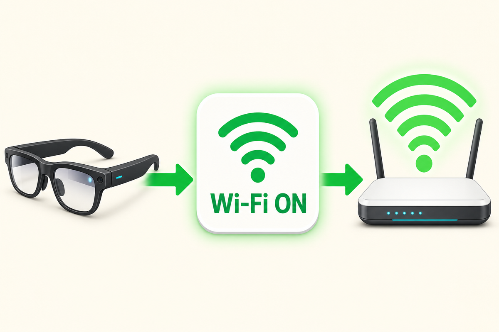

# Wi-Fi ON

<p align="center"></p>

Rokid AI Glasses RV101のWi-Fiが切れたとき、メガネ単体で復旧するための小さなアプリです。

**現在のバージョン: 0.5**（同梱の`Wi-Fi-ON.apk`）

アプリ一覧から「Wi-Fi ON」を開くだけで、Wi-Fiを自動的にオンにし、以前使ったWi-Fiへ再接続します。普段の復旧ではMacも開発用5ピンケーブルも必要ありません。

最新版では、Rokidを再起動したあとでも、Wi-Fi復旧後に「Rokid Control」用の接続も自動で復旧します。

## できること

1. Rokidで「Wi-Fi ON」を開く
2. アプリがWi-Fiを自動的にオンにする
3. 登録済みのWi-Fiへ自動的に再接続する
4. 登録済みMacから「Rokid Control」で接続できる状態を自動で復旧する

黒い画面に「Wi-Fiはオンです」「Wi-Fiに接続しました」と表示されれば完了です。
接続先は、Rokidに登録済みのWi-Fiのうち、その場で使えるものが自動的に選ばれます。

## 用意するもの

- **Rokid AI Glasses RV101**
- **Mac**
- **Rokidの開発用5ピンケーブル**
  充電用ケーブルとは別の開発用ケーブルです。入手方法はRokidの販売元またはサポートへ確認してください。
- **Homebrew**（Mac用のソフト導入ツール）
  入っていない場合は、初回準備の途中で案内が表示されます。
- **Rokidのスマホアプリ側で開発者モード（ADB）を有効にしておくこと**
  開発用5ピンケーブルをつなぐだけではADBは有効になりません。スマホアプリでRV101を接続し、開発者モード（ADB）を有効にしてから進めてください。

初回のみ、Macとの接続に必要なソフトを自動で準備します。ダウンロードに数分かかる場合があります。画面が止まったように見えても、そのままお待ちください。

## 最初の準備

### 1. この一式をMacへ保存する

GitHub画面上部の緑色の「Code」ボタンを押し、「Download ZIP」を選びます。ダウンロードしたZIPファイルをダブルクリックして開いてください。

### 2. Rokidへアプリを入れる

1. Rokid以外のAndroid端末（スマホなど）がMacにつながっていたら、いったん外します。
2. Rokidを開発用5ピンケーブルでMacへつなぎます。
3. `Rokidへアプリを入れる.command`をダブルクリックします。
4. RokidにUSB接続の確認が出た場合は許可します。
5. 「接続されている機器」に`Rokid RG-glasses`と表示されたこと、および行われる2つの内容を確認し、`y`を入力してEnterを押します。
6. アプリのインストールと、「Rokid Control」用の接続復旧設定が自動で行われます。
7. 「インストールが完了しました」と表示されたら準備完了です。

<details>
<summary>Macに止められた場合</summary>

「Appleは、このファイルにMacに損害を与えたり、プライバシーを侵害する可能性のあるマルウェアが含まれていないことを検証できませんでした」と表示された場合は、次のように許可します。

1. 警告画面では「ゴミ箱に入れる」を押さず、「完了」を押します。
2. Macの「システム設定」を開きます。
3. 左側の「プライバシーとセキュリティ」を選び、下へスクロールします。
4. 「セキュリティ」に表示された`Rokidへアプリを入れる.command`の「このまま開く」を押します。
5. 確認画面でもう一度「このまま開く」を押し、Macのログインパスワードを入力します。

許可ボタンは、ファイルを開こうとしてから約1時間表示されます。詳しくは[Apple公式の説明](https://support.apple.com/ja-jp/guide/mac-help/mh40617/mac)を参照してください。

ターミナルに「プロセスが完了しました」と出たら設定は終了しています。ウィンドウ左上の赤いボタン、または`command + W`で閉じてください。

</details>

## 普段の使い方

1. Rokidのアプリ一覧を開きます。
2. 「Wi-Fi ON」を選んで起動します。
3. 「Wi-Fiはオンです」と表示されるまで少し待ちます。
4. 「Wi-Fiに接続しました」「Mac操作用の接続も復旧しました」と表示されたら、右テンプルを1回タップしてアプリを閉じます。
5. Macから操作する場合は、そのあと「Rokid Control」を開きます。

アプリを閉じたあともWi-Fiはオンのままです。このアプリが裏で動き続けることはありません。

<details>
<summary>自動でオンにならなかった場合</summary>

AndroidやRokidの更新などで自動操作が許可されなかった場合は、アプリが正式なWi-Fi設定画面を開きます。

RV101では、この画面はWi-Fiの行が選ばれた状態で開きます。右テンプルを1回タップしてください。これは「Photo to Mac」がWi-Fi設定を開いたときと同じ操作です。

Rokid本体の更新で画面の作りが変わった場合は、Wi-Fiの行まで移動してからタップしてください。

</details>

## 安全性について

- このアプリが使うのは、Wi-Fiの確認・復旧と、Rokid Control用の接続だけです。
- カメラ、マイク、位置情報、写真、連絡先にはアクセスしません。
- 初回準備で許可したMacだけが、Wi-Fi経由でRokidへ接続できます。
- 登録していないパソコンからは接続できないことを実機で確認しています。

自宅など、信頼できるWi-Fiでお使いください。

<details>
<summary>配布ファイルが正しいか確認する方法</summary>

`Wi-Fi-ON.apk`が配布されたものと同一か確認したい場合は、Terminalでこのフォルダへ移動し、次を実行してください。

```bash
shasum -a 256 Wi-Fi-ON.apk
```

正しいSHA-256（v0.5）:

```text
2991653325c4dcbeb7bc0ab6f995c8db2057fe8424b43bd272e3f1b055b214de  Wi-Fi-ON.apk
```

</details>

## 削除するには

1. Rokidの設定 → アプリ →「Wi-Fi ON」→ アンインストールで削除します。
2. **Rokidを一度再起動してください。** これでMac操作用の接続もオフになります。

削除しても、Wi-Fiの設定や登録済みネットワークには影響しません。

## 注意

- 以前接続したことがあるWi-Fiへ再接続するアプリです。
- 初めて使うWi-Fiでは、Rokidの設定画面でネットワーク名とパスワードを登録してください。
- Rokidが省電力動作や写真・動画の同期後にWi-Fiを切った場合は、もう一度「Wi-Fi ON」を開いてください。
- 「Rokid Control」用の接続復旧には、最新版の`Rokidへアプリを入れる.command`で一度セットアップしておく必要があります。
- Rokid AI Glasses RV101の実機で確認しています。他の機種での動作は未確認です。

## 関連アプリ

- [Photo to Mac](https://github.com/ksuzukigh/rokid-photo-to-mac)：Rokid AI Glasses RV101で撮影した写真をMacへ送ります。
- [Rokid Control](https://github.com/ksuzukigh/rokid-mac-control)：Rokid AI Glasses RV101の画面をMacに表示し、Macから操作します。

<details>
<summary>テスト済みの内容</summary>

「Rokid Control」のWi-Fi監視を停止した状態で、次を確認しています。

- Rokidの正式な設定画面からWi-Fiをオフ
- 「Wi-Fi ON」の起動だけでWi-Fiがオンへ復旧
- 登録済みWi-Fiへ自動再接続
- Rokid再起動後に「Wi-Fi ON」を開くだけで「Rokid Control」用接続が自動復旧
- 「Rokid Control」が新しい接続先を自動検出し、Rokid画面を再表示
- Wi-Fi接続後にテンプルを1回押すとアプリだけ終了
- 登録済み鍵を持たない独立したADB環境からの接続をTLS認証で拒否
- アプリ一覧へ戻って30秒以上待っても、Wi-Fi設定が勝手に開かない
- アプリを完全終了した30秒後も接続を維持
- 自動操作に失敗した場合は正式なWi-Fi設定を開く予備経路を搭載

</details>

<details>
<summary>開発者向けの詳しい情報</summary>

### 仕組み

RV101はAndroid 12です。このアプリは最初にRokid独自の`settings_wifi_enable`を正式な端末内ブロードキャストでオンへ更新し、続けてAndroidに残されている旧来アプリ向けの互換動作を利用して`WifiManager.setWifiEnabled(true)`を試します。

セットアップ時には`WRITE_SECURE_SETTINGS`権限を付与します。このアプリが同権限で変更するのは、Wi-Fi接続後のAndroid標準`adb_wifi_enabled`だけです。これにより、再起動でワイヤレスデバッグがオフになっても、Rokid Control用のTLS接続を復旧できます。

初回のUSB接続で許可したMacの公開鍵がRokidへ登録されます。Wi-Fi接続では、その鍵を持つMacだけがTLSで暗号化された接続を確立できます。詳しい仕組みは[Android公式のADB Wi-Fi設計](https://android.googlesource.com/platform/packages/modules/adb/+/refs/heads/main/docs/dev/adb_wifi.md)で確認できます。

登録済みの鍵を持たない独立したADB環境からRV101へ接続し、TLS認証で拒否されることを実機確認しています。

自動操作が拒否された場合、または8秒以内にオンにならなかった場合は、`Settings.ACTION_WIFI_SETTINGS`で正式な設定画面を開きます。

アプリはWi-Fiを常時監視するサービスではありません。起動時の復旧だけを行います。

初回セットアップ後、Macでは`adb`の接続用プロセスが動いたままになる場合があります。終了するにはTerminalで`adb kill-server`を実行します。ただし、ほかのRokid用ツールを使用中は終了しないでください。

初回準備でMacへ入れた`adb`が不要になった場合は、Terminalで`brew uninstall android-platform-tools`を実行すると削除できます。ただし、ほかのRokid用ツールで使用している場合は削除しないでください。

### Androidアプリを自分で作り直す場合

JDK 17、Android SDKが必要です。

```bash
export JAVA_HOME=/opt/homebrew/opt/openjdk@17/libexec/openjdk.jdk/Contents/Home
export ANDROID_SDK_ROOT=/opt/homebrew/share/android-commandlinetools
export ROKID_STORE_PASSWORD='配布用キーストアのパスワード'
export ROKID_KEY_PASSWORD="$ROKID_STORE_PASSWORD"
./gradlew assembleRelease
```

同梱の`Wi-Fi-ON.apk`は`app/build/outputs/apk/release/app-release.apk`を複製したものです。
配布用の`~/keys/rokid-wifi-on-release.jks`とパスワードはリポジトリへ追加せず、安全な場所へバックアップしてください。どちらかを失うと、同じ署名の更新版を配布できなくなります。

</details>

<details>
<summary>変更履歴</summary>

- **0.5**（2026-07-28）— Wi-FiとMac操作用接続を自動復旧する操作へ戻し、安全性を再確認
- **0.4**（2026-07-28）— Mac操作用の接続を明示操作時だけオンに変更し、開き直し時の確認、権限説明、配布Releaseを改善
- **0.3**（2026-07-27）— 表示とタップ動作、画面離脱後の処理、インストーラー、README、CIを改善
- **0.2**（2026-07-27）— Rokid再起動後のWi-Fi・Mac接続復旧と正式な配布用署名に対応
- **0.1**（2026-07-22）— 初版

</details>
