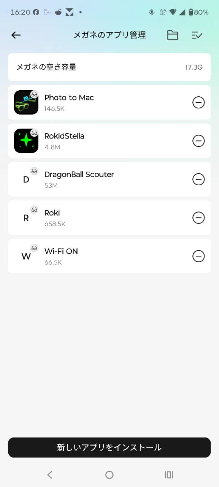

# Wi-Fi ON

Rokid AI Glasses RV101のWi-Fiが切れたとき、メガネ単体で復旧するための小さなアプリです。Wi-Fiが切れると、Rokid ControlなどのパソコンからRokidを操作するアプリも使えなくなります。

Wi-Fi接続が切れたときにこのアプリがない場合、開発用5ピンケーブルで接続して復旧する必要がありましたが、このアプリがあればそのような面倒はなくなります。

**現在のバージョン: 0.7**（同梱の`Wi-Fi-ON.apk`）

アプリ一覧から「Wi-Fi ON」を開くだけで、Wi-Fiを自動的にオンにし、以前使ったWi-Fiへ再接続します。

## できること

Rokidで本アプリ「Wi-Fi ON」を開くと、次の2つを実行します。

1. Rokid本体のWi-Fiをオンにする
2. ワイヤレスADB接続を復旧する

Rokidの画面に「Wi-Fiに接続しました」「ワイヤレスADB接続も復旧しました」と表示されれば完了です。
接続先は、Rokidに登録済みのWi-Fiのうち、その場で使えるものが自動的に選ばれます。

## 用意するもの

- **Rokid AI Glasses RV101**
- **MacまたはWindows 10/11のPC**
- **Rokidの開発用5ピンケーブル**
  充電用ケーブルとは別の開発用ケーブルです。入手方法はRokidの販売元またはサポートへ確認してください。
- Macの場合は**Homebrew**（Mac用のソフト導入ツール）
  入っていない場合は、初回準備の途中で案内が表示されます。
- **Rokidのスマホアプリ側で開発者モード（ADB）を有効にしておくこと**
  開発用5ピンケーブルをつなぐだけではADBは有効になりません。スマホアプリでRV101を接続し、開発者モード（ADB）を有効にしてから進めてください。

初回のみ、接続に必要なADBを準備します。WindowsではGoogle公式のAndroid Platform-Toolsを`%LOCALAPPDATA%\Rokid-Wi-Fi-ON\platform-tools`へ自動で保存します。MacではHomebrewを使って準備します。ダウンロードに数分かかる場合があります。画面が止まったように見えても、そのままお待ちください。

## 最初の準備

### 1. Wi-Fi ON一式をダウンロードする

[最新版のWi-Fi ON一式をダウンロード](https://github.com/ksuzukigh/rokid-wifi-on/releases/latest/download/Wi-Fi-ON.zip)し、ダウンロードしたZIPファイルを展開してください。

### 2. Windowsからアプリを入れる場合

1. Rokid以外のAndroid端末（スマホなど）がWindows PCにつながっていたら、いったん外します。
2. Rokidを開発用5ピンケーブルでWindows PCへつなぎます。
3. `install-wifi-on.cmd`をダブルクリックします。
4. 初回だけ、インストーラーがGoogle公式のAndroid Platform-Toolsを自動でダウンロードします。
5. 接続された機器と実行内容を確認し、`y`を入力してEnterを押します。
6. 「Installation completed successfully.」と表示されたら準備完了です。

WindowsでRokidが見つからない場合は、RokidのADB開発者モードが有効か、開発用5ピンケーブルを使っているかを確認してください。

Windowsに止められた場合

「WindowsによってPCが保護されました」と表示された場合は、次のように許可します。

1. 警告画面の「詳細情報」を押します。
2. 表示されたファイル名が`install-wifi-on.cmd`であることを確認し、「実行」を押します。

詳しくは[MicrosoftのSmartScreenに関する説明](https://learn.microsoft.com/ja-jp/windows/apps/package-and-deploy/smartscreen-reputation)を参照してください。

### 3. Macからアプリを入れる場合

1. Rokid以外のAndroid端末（スマホなど）がMacにつながっていたら、いったん外します。
2. Rokidを開発用5ピンケーブルでMacへつなぎます。
3. `Rokidへアプリを入れる.command`をダブルクリックします。
4. 「接続されている機器」に`Rokid RG-glasses`と表示されたこと、および行われる2つの内容を確認し、`y`を入力してEnterを押します。
5. アプリのインストールと、「Rokid Control」用の接続復旧設定が自動で行われます。
6. 「インストールが完了しました」と表示されたら準備完了です。

Macに止められた場合

「Appleは、このファイルにMacに損害を与えたり、プライバシーを侵害する可能性のあるマルウェアが含まれていないことを検証できませんでした」と表示された場合は、次のように許可します。

1. 警告画面では「ゴミ箱に入れる」を押さず、「完了」を押します。
2. Macの「システム設定」を開きます。
3. 左側の「プライバシーとセキュリティ」を選び、下へスクロールします。
4. 「セキュリティ」に表示された`Rokidへアプリを入れる.command`の「このまま開く」を押します。
5. 確認画面でもう一度「このまま開く」を押し、Macのログインパスワードを入力します。

許可ボタンは、ファイルを開こうとしてから約1時間表示されます。詳しくは[Apple公式の説明](https://support.apple.com/ja-jp/guide/mac-help/mh40617/mac)を参照してください。

ターミナルに「プロセスが完了しました」と出たら設定は終了しています。ウィンドウ左上の赤いボタン、または`command + W`で閉じてください。

## 普段の使い方

1. Rokidのアプリ一覧を開きます。
2. 「Wi-Fi ON」を選んで起動します。
3. 「Wi-Fiはオンです」と表示されるまで少し待ちます。
4. 「Wi-Fiに接続しました」「ワイヤレスADB接続も復旧しました」と表示されたら、右テンプルを1回タップしてアプリを閉じます。
5. パソコンから操作する場合は、そのあと使用するRokid用アプリ「例：Rokid Control」を開きます。

アプリを閉じたあともWi-Fiはオンのままです。このアプリが裏で動き続けることはありません。

自動でオンにならなかった場合

AndroidやRokidの更新などで自動操作が許可されなかった場合は、アプリがAndroid標準のWi-Fi設定画面を開きます。

RV101では、この画面はWi-Fiの行が選ばれた状態で開きます。右テンプルを1回タップしてください。別に配布している「Photo to Mac」と同じ動作をします。

## ADBについて

### ADBとは

ADB（Android Debug Bridge）は、パソコンからAndroid端末へ命令を送るための標準的な仕組みです。

Wi-Fi ONが使うのは、Android標準の暗号化されたワイヤレスADBです。アプリが独自の通信サービスをインターネット上に開くわけではありません。

### 初回セットアップで行うこと

初回だけ、開発用5ピンケーブルでRokidとパソコンをつなぎ、次の設定を行います。

1. パソコンのADB公開鍵をRokidへ登録します。
2. Wi-Fi ONアプリをRokidへインストールします。
3. Wi-Fi ONアプリに、Androidの保護された設定を変更するための権限を付与します。
4. Wi-Fi ONを起動したとき、Wi-Fiの復旧に続けて暗号化されたワイヤレスADBをオンにします。

この権限を付与するのは、通常のAndroidアプリからはワイヤレスADBをオンにできないためです。Wi-Fi ONがこの権限で変更するのは、ワイヤレスADBを有効にするためのAndroid標準設定だけです。

初回セットアップが済んだパソコンは、USBケーブルを外したあとも、同じWi-Fi上で登録済みのADB鍵を使ってRokidへ接続できます。別のパソコンは、初回セットアップを行わない限り接続できません。

## 安全性について

- このアプリが行うのは、Wi-Fiの確認・復旧と、ワイヤレスADB接続の有効化だけです。
- アプリ自身はインターネットへ接続する権限を持っておらず、データを外部へ送ることはできません。
- カメラ、マイク、位置情報、写真、連絡先にはアクセスしません。
- 初回準備で許可したMacまたはWindows PCだけが、Wi-Fi経由でRokidへ接続できます。
- 登録していないパソコンからは接続できません。
- Wi-FiへつながるとワイヤレスADB接続も自動でオンになります。自宅か外出先かは判別しません。

自宅など、信頼できるWi-Fiでお使いください。ワイヤレスADB接続をオフにするにはRokidを再起動してください。オフのまま使う場合は「Wi-Fi ON」を開かず、Rokidの通常のWi-Fi設定から接続します。

## 困ったとき

- 「ワイヤレスADB接続には初回設定が必要です」と表示される場合は、インストーラーを最後まで実行できていません。もう一度初回セットアップを行ってください。
- WindowsでRokidが見つからない場合は、開発者モード（ADB）が有効か、開発用5ピンケーブルを使っているかを確認してください。
- Wi-Fiが自動でオンにならず設定画面が開いた場合は、画面のWi-Fiの行を選び、右テンプルを1回タップしてください。
- Wi-Fi ONを削除した場合は、Rokidを一度再起動してください。これでワイヤレスADB接続もオフになります。

## 削除するには

1. スマートフォンでRokidアプリを開きます。
2. 「ホーム」→「ツールボックス」→「メガネのアプリ管理」の順に開きます。
3. 「Wi-Fi ON」の右側にある丸い「－」ボタンを押し、画面の案内に従って削除します。
4. **Rokidを一度再起動してください。** これでワイヤレスADB接続もオフになります。

※ Rokidアプリの更新で、画面や名前が少し変わることがあります。

削除しても、Wi-Fiの設定や登録済みネットワークには影響しません。

## 注意

- 以前接続したことがあるWi-Fiへ再接続するアプリです。
- 初めて使うWi-Fiでは、Rokidの設定画面でネットワーク名とパスワードを登録してください。
- Rokidが省電力動作や写真・動画の同期後にWi-Fiを切った場合は、もう一度「Wi-Fi ON」を開いてください。
- ワイヤレスADB接続の復旧には、最新版の`install-wifi-on.cmd`または`Rokidへアプリを入れる.command`で一度セットアップしておく必要があります。
- Rokid AI Glasses RV101用です。

## 関連アプリ

- [Photo to Mac](https://github.com/ksuzukigh/rokid-photo-to-mac)：Rokid AI Glasses RV101で撮影した写真をMacへ送ります。
- [Rokid Control](https://github.com/ksuzukigh/rokid-mac-control)：Rokid AI Glasses RV101の画面をMacに表示し、Macから操作します。

開発者向けの詳しい情報

### 仕組み

Wi-Fi ONは、起動時にWi-Fiを復旧し、続けてワイヤレスADB接続を復旧します。常時Wi-Fiを監視したり、裏で動き続けたりするアプリではありません。

自動でWi-Fiをオンにできない場合は、RokidのWi-Fi設定画面を開きます。

変更履歴

- **0.7**（2026-08-02）— Windows用インストーラー（`install-wifi-on.cmd`）を追加。表示を「ワイヤレスADB接続」としてMac・Windowsの両方に合う表現へ統一
- **0.6**（2026-08-01）— 最新版一式を確実に取得できるダウンロードリンクを追加し、インストールと安全性の説明を現行仕様へ統一
- **0.5**（2026-07-28）— Wi-FiとMac操作用接続を自動復旧する操作へ戻し、安全性を再確認
- **0.4**（2026-07-28）— Mac操作用の接続を明示操作時だけオンに変更し、開き直し時の確認、権限説明、配布Releaseを改善
- **0.3**（2026-07-27）— 表示とタップ動作、画面離脱後の処理、インストーラー、README、CIを改善
- **0.2**（2026-07-27）— Rokid再起動後のWi-Fi・Mac接続復旧と正式な配布用署名に対応
- **0.1**（2026-07-22）— 初版

